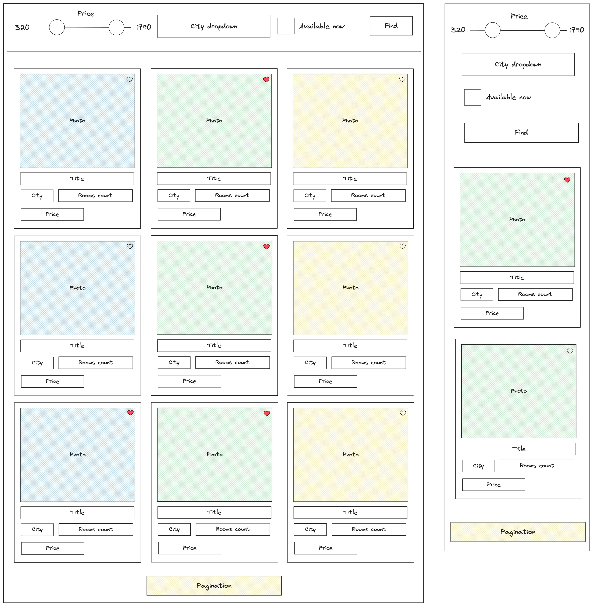

# Property Search Test Task

## Requirements

Complete the tasks as they are listed, and only address optional tasks once the earlier tasks have been completed.

1. Display a property list. The UI should be responsive (more details below)
    - All the data is ready and mocked for you - use function `fetchProperties` from [src/api/properties.ts](src/api/properties.ts)
    - All stylistic details are up to you. Don't spend too much time on it.
2. Implement filters:
    - Min/max price. Ideally it should be a slider component. You can implement a basic variant with two inputs if you don’t have enough time
    - City selection (dropdown)
      - Options: 
        - All
        - Atlanta 
        - New York
    - Available now checkbox
3. Implement pagination
    - Page size - 9
4. **Optional**: Implement filters sync with URL (?page=1&minPrice=10)
   - Include only non-empty filters
   - Don’t include pageSize field
5. **Optional**: Implement like button

## UI Part
- Check the wireframe (wireframe.jpg)
- We have the following breakpoints
    - mobile: 0-599px
        - make one column layout
    - tablet: 600-959px
        - two columns
    - desktop: 960px
        - three columns